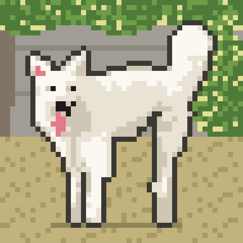

  

<h1 align="center">Joaquín Alarcón Berríos</h1>

  <b>Product Owner · AI & Innovation · Process Automation & Operational Scalability</b> 
  Building products that turn manual, fragmented operations into automated, measurable, data-driven systems.

  
  

---

## About me

I work at the intersection of **product, operations, data and finance**. I design workflows, back-office platforms and internal tools that remove friction between teams and let a business scale without scaling headcount at the same rate.

- **Currently** leading product initiatives at **Gauss Control**, a risk-management platform for transport and logistics operations — owning internal operations, scalability and order-to-cash tooling.
- **Previously** at **Examedi** (HealthTech), working on product optimization, growth, and B2B / B2C SaaS in a regulated, operationally complex environment.
- **Focus areas:** AI agents & copilots, process automation, IoT, mining and logistics operations, startups.
- Based in Chile · working in Spanish and English.

## What I do

| Product | Tech |
|---|---|
| Product discovery & roadmapping | AI agents, LLM copilots & workflow automation |
| PRDs, user stories, DoR / DoD, sprint planning | Full-stack prototyping (Next.js, NestJS, React) |
| Process design & operational scalability | Data pipelines, dashboards & KPIs |
| Back-office, CRM & order-to-cash platforms | Integrations (Jira, HubSpot, Google Workspace, n8n) |

## Tech stack

## Featured projects

| Project | Description |
|---|---|
| [gauss-edp-platform](https://github.com/joacoalarcon/gauss-edp-platform) | Next.js + NestJS monorepo to manage progress payment statements (EDPs) end to end. |
| [aiagentauditor](https://github.com/joacoalarcon/aiagentauditor) | Prototype for auditing and evaluating AI agent behavior. |
| [Copilot-Gauss](https://github.com/joacoalarcon/Copilot-Gauss) | AI copilot for internal operations at Gauss Control. |
| [polymarket-agents](./projects/polymarket-agents) | Multi-agent framework (scout → risk engine → executor) for prediction-market portfolios. |
| [fimu-web](https://github.com/joacoalarcon/fimu-web) | Official website for FiMU. |

---

<i>Always happy to talk about product, automation and AI applied to real operations — reach out on LinkedIn.</i>

